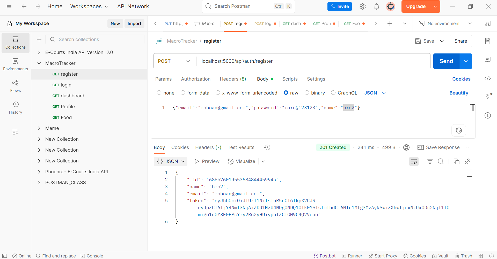
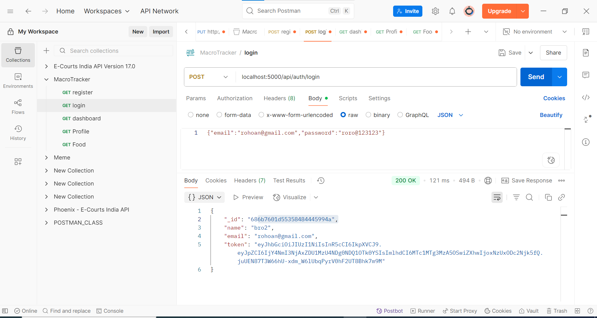
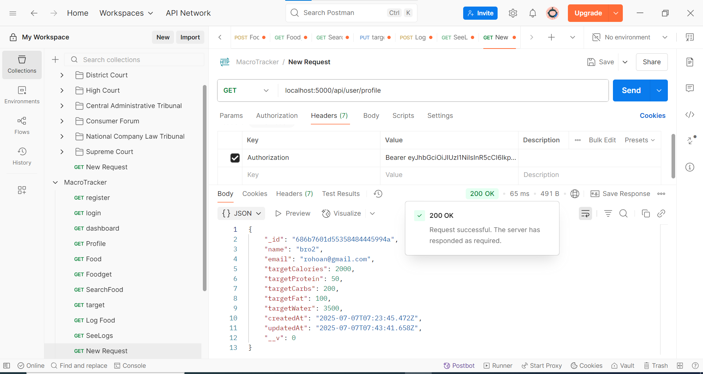
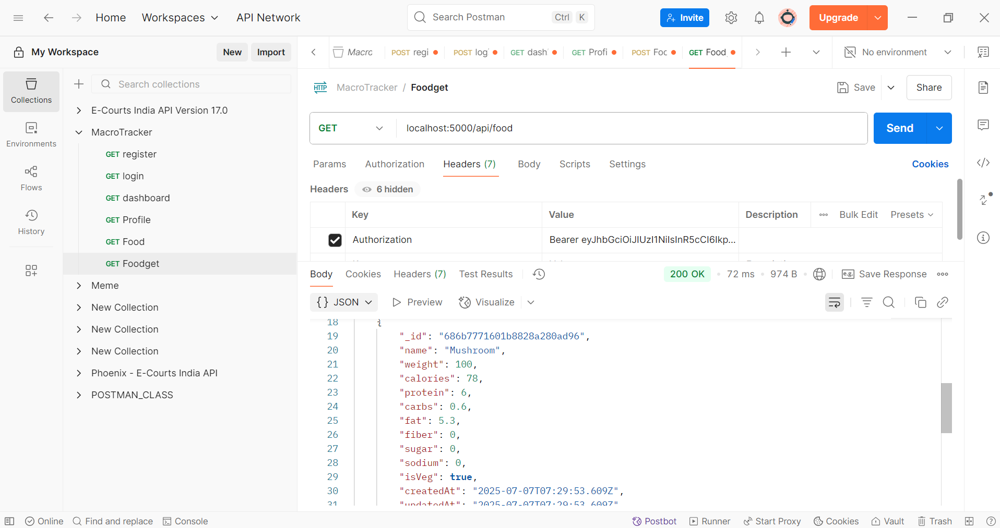
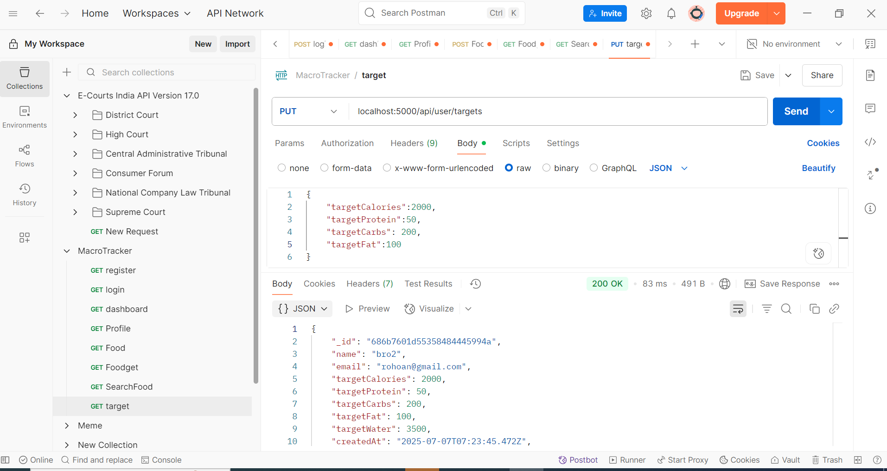
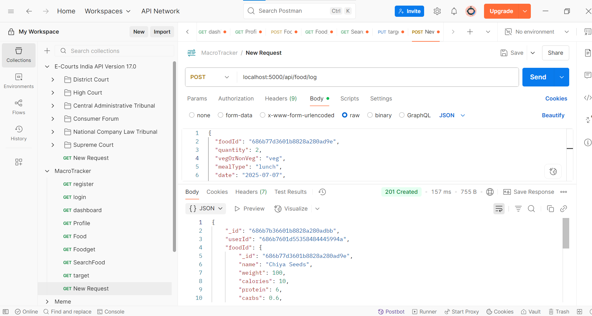
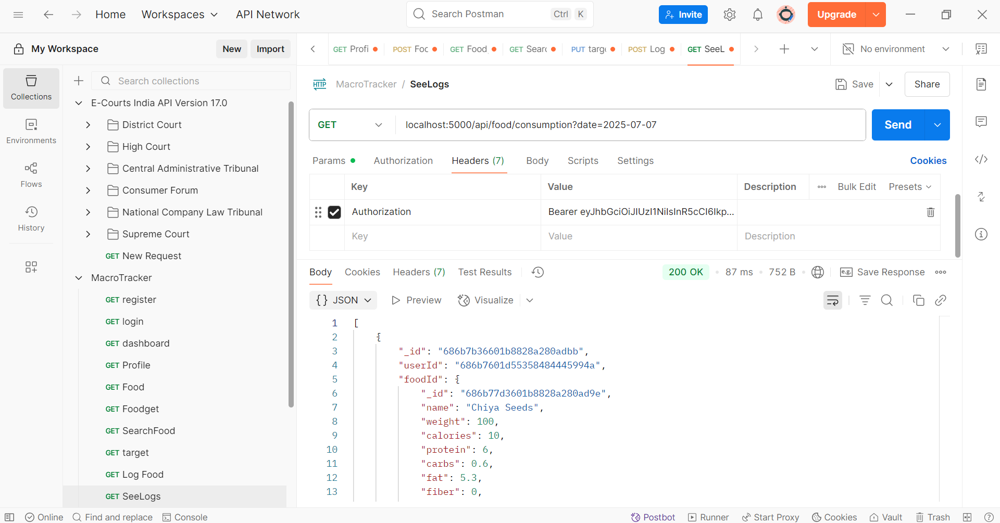
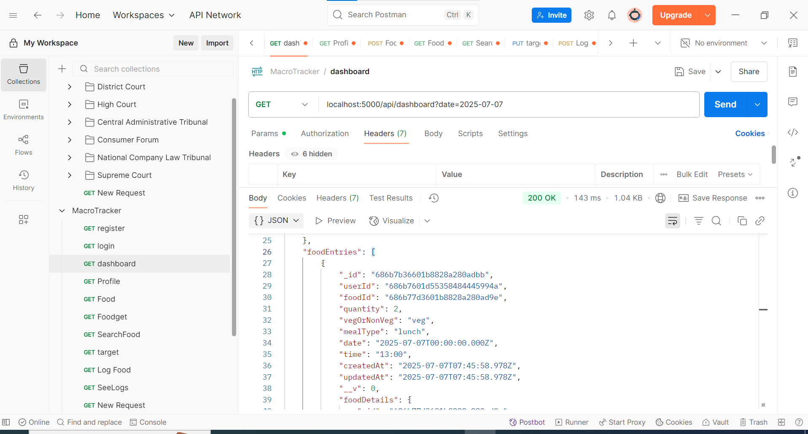

<h1>

<h2>Register </h2>

<h2>Login </h2>

<h2>Profile</h2>

<h2>Get Food</h2>

<h2> Get Particular food </h2>

<h2> Set Target </h2>

<h2> Log Food </h2>

<h2> Fetch logs according to date </h2>

<h2> Dashboard </h2>

